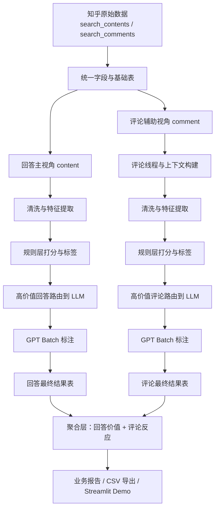

# 面向游戏社区反馈的高价值评论筛选与 LLM 标注流水线

这个项目围绕《原神》知乎社区数据，搭建了一条从原始抓取数据到结构化反馈报告的完整分析链路。它不是单纯做“正负面情感分类”，而是尝试回答一个更接近真实业务的问题：在大量回答、评论、回复、玩梗、争吵和长文本表达中，哪些内容真正值得产品、市场、运营、文案或策划团队关注，哪些内容又只是噪声、情绪宣泄或上下文依赖极强的局部对话。

当前版本采用“规则层 + LLM 层”的双阶段架构。规则层负责大规模、低成本、可解释的数据清洗、特征提取、打分和预筛选；LLM 层负责处理长评论、复杂立场、隐含结论、竞品比较和强上下文依赖文本。整个项目的目标，是把知乎原始社区文本转换成可以被分析、路由、标注、聚合和展示的数据资产。

## 项目定位

> 从中文游戏社区的海量讨论中，自动筛出对公司真正有价值的反馈，并将复杂样本路由给 LLM 做深度语义标注。

## 这个项目解决什么问题

在真实社区场景里，直接做全量情感分析通常并不够用。因为很多文本虽然带有情绪，但并没有业务价值；很多评论脱离上下文无法理解；很多长文本并不是单一正面或负面，而是同时包含观点、归因、比较和建议。

因此，这个项目重点解决以下几类问题：

1. 如何把知乎导出的原始 `content` 和 `comment` 数据整理成统一的数据表。
2. 如何在“问题 - 回答 - 评论/回复”的关系中理解文本，而不是把评论当成孤立句子。
3. 如何从大量低质量评论、抽象话、阴阳怪气、社区对线和纯玩梗文本中，筛出真正有反馈价值的内容。
4. 如何在不把成本拉得过高的前提下，只把值得深度处理的文本送入 LLM。
5. 如何将规则层结果和 LLM 标注结果融合，最终产出一份能让业务方读懂的社区反馈报告。

## 数据视角设计

项目当前采用“双视角”结构，但主次关系比较明确。

`content` 视角是主视角。知乎回答通常更长、更完整，也更容易出现对版本内容、角色设计、商业化策略、剧情结构、玩法体验和竞品比较的系统表达。因此，回答层更适合承载“公司可消费”的核心反馈。

`comment` 视角是辅助视角。评论和回复虽然更碎片化，但它们非常适合补充社区反应，比如支持与反对、争议程度、阴阳怪气比例、补充论据和群体分裂情况。它们不能完全替代主内容，但可以帮助判断一条高价值回答在社区中究竟是引发共鸣、质疑还是争执。

因此，项目最终同时输出一下几点：

- 回答本身的业务价值分析
- 回答下评论区的社区反应分析
- 规则层与 LLM 层融合后的高价值反馈结果

## 流水线总览

整条链路可以概括为：

```text
原始数据 -> 上下文整理 -> 文本清洗 -> 特征提取 -> 规则打分 -> 高价值路由 -> LLM Batch 标注 -> 结果回填 -> 聚合报告
```

如果展开成 `content` 与 `comment` 两条并行支线，大致如下：



## 流水线分步说明

### 1. 原始数据接入

输入主要来自知乎抓取后的两类原始数据：

- `search_contents_*.csv`
- `search_comments_*.csv`

项目首先会统一字段命名、补全基础列，并将不同来源的数据整理成标准 schema。这个阶段的重点不在“分析”，而在于保证后续链路能稳定识别回答、评论、点赞、问题标题、回答摘要等关键字段。

### 2. 上下文重建

这一步是项目的关键差异点之一。很多知乎评论并不是独立文本，例如“你这就太想当然了”“典中典”“建议先补剧情”这类回复，离开原问题或原回答几乎无法判断含义。

因此，项目会为每条文本补充尽可能可用的上下文信息，例如：

- 问题标题 `question_title`
- 回答摘要 `answer_summary`
- 当前评论正文 `comment_text`
- 回答正文 `answer_text`
- 是否存在回复关系

这个阶段的目标，不是做完整对话树建模，而是尽量避免把强上下文依赖文本误判成独立、直接的产品反馈。

### 3. 文本清洗

清洗层负责处理原始数据中的噪声和低价值样本。当前策略包括：

- 去空值与明显异常值
- 去极短、模板化、无信息量文本
- 去重或近似去重
- 保留后续可分析所需的核心字段

这一步的意义在于控制规则层和 LLM 层的输入质量，减少“纯水评论”干扰后续打分。

### 4. 词表驱动的特征提取

项目在 `config/taxonomies.py` 中维护了较完整的中文社区词表，并在预处理阶段抽取多维特征。当前重点覆盖的词表类别包括：

- 产品体验词
- 商业化词
- 品牌传播词
- 社区冲突词
- 竞品比较词
- 剧情讨论词
- 反讽 / 阴阳怪气触发词
- 抽象梗词
- 因果词、结论词、影响词、建议词
- 原神角色、系统、玩法、版本热点对象词
- 多义词 / 别名归一词

这些词表不是简单用来做“词频统计”，而是服务于后续几个关键问题：

- 文本是否在讨论明确对象
- 文本是否包含因果与结论
- 文本是否具备业务模式特征
- 文本是否更像社区情绪而不是产品反馈
- 文本是否存在强反讽、抽象表达或上下文依赖

### 5. 规则层打分

规则层目前采用“三分 + 两个辅助分”的设计。核心思想不是直接判断“好评/差评”，而是先判断一条文本值不值得被公司认真看见。

当前主要分数包括：

- `quality_score`：文本本身是否完整、清晰、结构化
- `context_dependency_score`：是否高度依赖上下文才能理解
- `business_value_score`：是否对业务团队有现实参考价值
- `target_specificity_score`：是否指出了明确对象
- `actionability_score`：是否包含后果、建议、改进方向
- `feedback_entropy_score`：综合反映信息密度与优先级

其中，`feedback_entropy_score` 不是严格意义上的信息论熵，而是项目内部定义的“反馈信息密度”指标，用来帮助排序和路由。

### 6. 高价值反馈识别

规则层不会直接把所有文本送给 LLM，而是先做一次“高价值反馈预判”。这一步综合考虑业务价值、质量、对象明确度、可执行性和上下文依赖，输出：

- `is_high_value_feedback_pre_llm`
- `high_value_reason`

这样做的目的，是让系统先低成本筛掉大部分噪声和普通样本，只保留真正值得进一步分析的文本。

### 7. LLM 路由

项目会继续根据规则层分数与文本特征，决定哪些样本需要进入 LLM 层。典型会被送入 GPT Batch 的样本包括：

- 高价值长回答
- 高信息密度长评论
- 强上下文依赖但业务价值较高的评论
- 带竞品比较的复杂样本
- 规则层难以稳定理解的反讽/混合立场文本

路由阶段会输出：

- `needs_llm_analysis`
- `llm_priority_score`
- `llm_route_reason`

这一步的核心价值，是实现成本受控的“分层处理”。

### 8. GPT Batch 标注

被路由的样本会被整理成 JSONL 文件，使用 OpenAI Batch 接口批量处理。项目当前已经支持两类请求文件：

- `data/processed/llm_requests.jsonl`
- `data/processed/content_llm_requests.jsonl`

LLM 接收的不是孤立评论，而是经过整理的上下文文本，通常会带有问题标题、回答摘要或正文，从而更稳定地输出结构化标签。

### 9. 结果回填与融合

Batch 结果下载后，项目会解析 LLM 返回并与规则层结果融合，形成最终表。回填后通常会补充这些字段：

- 情感方向
- 业务模式
- 是否竞品比较
- 讨论目标
- 立场摘要
- 置信度
- 是否高价值反馈
- 是否需要人工复核

这一步的关键思想不是“让 LLM 覆盖规则层”，而是让两层形成互补：规则层提供稳定、可解释、低成本的基础结构；LLM 层负责复杂语义理解和细粒度标签补全。

### 10. 聚合与报告输出

项目最终会生成多类结果文件，并在 Streamlit Demo 中展示。当前比较重要的输出包括：

- `labeled_final.csv`：评论最终结果
- `labeled_content_final.csv`：回答最终结果
- `comment_reaction_summary.csv`：评论区反应摘要
- `content_feedback_report.csv`：回答价值与评论反应的合并报告
- `business_modes.csv`：业务模式分布
- `platform_summary.csv`：平台层统计

其中，`content_feedback_report.csv` 是当前最适合做展示和汇报的一份表，因为它把“回答本身的业务价值”与“评论区的支持、反对、争议情况”放到了同一个视角下。

## 当前评分公式设计

下面是当前项目中已经接到代码里的具体评分公式。

### `target_specificity_score`

这个分数用于衡量文本是否明确指出了讨论对象，例如角色、系统、玩法、版本内容、剧情对象或竞品对象。

```text
score = 0
if target_specificity_group_count >= 1: score += 1
if target_specificity_group_count >= 2: score += 1
if canonical_entity_hit_count >= 1 or target_specificity_term_hit_count >= 3: score += 1

target_specificity_score = min(score, 3)
```

这个分数越高，说明文本越不像泛泛吐槽，而更像对具体对象的反馈。

### `actionability_score`

这个分数衡量文本是否不仅表达态度，还表达了后果、建议、改进方向或较清晰的问题指向。

```text
score = 0
if impact_hit_count > 0: score += 1
if actionability_term_hit_count > 0: score += 1
if causal_hit_count > 0 and target_specificity_score >= 1: score += 1
if impact_hit_count > 0 and feedback_modes 命中以下任一:
    product_experience / monetization / brand_communication / competition
    -> score += 1

actionability_score = min(score, 4)
```

它识别的是“可以进入反馈闭环”的文本，而不仅仅是情绪表态。

### `quality_score`

这个分数衡量文本是否具备较完整的表达质量和结构质量。

```text
score = 0
if text_length >= 20: score += 1
if text_length >= 80: score += 1
if text_length >= 180: score += 1
if causal_hit_count > 0: score += 1
if comparative_hit_count > 0: score += 1
if causal_hit_count > 0 and comparative_hit_count > 0: score += 1
if target_specificity_group_count >= 1: score += 1
if target_specificity_group_count >= 2: score += 1
if conclusion_hit_count > 0: score += 1

if is_low_value: score -= 2
if sarcasm_hit_count > 0 and target_specificity_group_count == 0: score -= 1
if community_term_hit_count > 0 and feedback_modes 只有 1 类: score -= 1

quality_score = max(score, 0)
```

高质量分通常意味着文本更完整、更可解释，也更可能是认真反馈而不是纯水评论。

### `context_dependency_score`

这个分数衡量文本是否高度依赖问题、回答或上文评论才能理解。

```text
score = 0
if text_length <= 12: score += 2
elif text_length <= 25: score += 1

if sarcasm_hit_count > 0: score += 1
if sarcasm_marker_hit_count > 0: score += 1
if abstract_slang_hit_count > 0: score += 1
if reference_dependency_hit_count > 0: score += 1
if reference_dependency_hit_count > 0 and target_specificity_group_count == 0: score += 1
if answer_coupling_hit_count > 0: score += 2
if answer_coupling_hit_count >= 2: score += 1
if community_term_hit_count > 0 and (sarcasm_hit_count > 0 or abstract_slang_hit_count > 0): score += 1

if target_specificity_group_count >= 2: score -= 1
if causal_hit_count > 0 and text_length >= 40: score -= 1

context_dependency_score = max(score, 0)
```

这个分数高不代表内容差，而是代表该文本更需要结合上下文理解。

### `business_value_score`

这个分数衡量文本对业务团队是否有现实参考价值。

```text
score = 0
if product_term_hit_count > 0: score += 2
if monetization_term_hit_count > 0: score += 2
if brand_term_hit_count > 0: score += 2
if competitor_term_hit_count > 0: score += 2
if plot_term_hit_count > 0: score += 1
if community_term_hit_count > 0: score += 1

if target_specificity_group_count >= 1: score += 1
if target_specificity_group_count >= 2: score += 1

if impact_hit_count > 0: score += 2
if actionability_term_hit_count > 0: score += 1

if likes >= 20: score += 1
if likes >= 100: score += 1

if feedback_modes == {"community_conflict"} and target_specificity_group_count == 0:
    score -= 2
if abstract_slang_hit_count > 0 and score <= 2 and target_specificity_group_count == 0:
    score -= 2
if answer_coupling_hit_count > 0 and feedback_modes 没有命中以下任一:
    product_experience / monetization / brand_communication / competition / plot_discussion
    -> score -= 1

business_value_score = max(score, 0)
```

这个分数高，说明文本更可能被产品、商业化、市场、社区运营或剧情团队真正消费。

### `feedback_entropy_score`

这是当前项目用于排序和路由的综合信息密度分。

```text
score =
    quality_score * 0.45
  + target_specificity_score * 0.8
  + actionability_score * 0.9
  + min(business_value_score, 10) * 0.3

if context_dependency_score >= 5:
    score -= 1.0
elif context_dependency_score >= 3:
    score -= 0.5

if sarcasm_hit_count > 0 and business_value_score == 0:
    score -= 1.5

feedback_entropy_score = round(max(score, 0), 2)
```

它不是学术上的严格信息熵，而是项目内部定义的“反馈信息密度”排序分。

### 高价值反馈规则 `rule_high_value_feedback`

规则层会先做一次“是否值得认真送入后续分析”的预判。

先做排除：

```text
if text_length < 10:
    return False, "excluded_short_vent"

if abstract_slang_hit_count >= 2
   and community_term_hit_count > 0
   and target_specificity_score == 0
   and actionability_score == 0:
    return False, "excluded_abstract_conflict_only"

if feedback_modes == {"community_conflict"}
   and target_specificity_score == 0
   and actionability_score == 0:
    return False, "excluded_community_flame_only"
```

再做命中判断：

```text
命中条件 1:
business_value_score >= 6 and quality_score >= 4

命中条件 2:
actionability_score >= 2
and feedback_modes 命中以下任一:
product_experience / monetization / brand_communication / competition

命中条件 3:
"plot_discussion" in feedback_modes
and quality_score >= 6
and target_specificity_score >= 1

命中条件 4:
"competition" in feedback_modes
and target_specificity_score >= 1
and business_value_score >= 5

命中条件 5:
context_dependency_score >= 4
and actionability_score >= 2
and business_value_score >= 5
```

只要命中任一条件，就会被标记为：

```text
is_high_value_feedback_pre_llm = True
```

### `engagement_weight`

互动权重当前采用对数放缩，它的目标是温和利用互动数据做排序参考。

```text
engagement_weight = round(1 + log1p(max(likes, 0)) / 5, 4)
```


### LLM 路由公式 `llm_priority_score`

路由阶段会在规则层基础上继续计算优先级。

```text
score = 0

if is_high_value_feedback_pre_llm: score += 3
if text_length >= 220: score += 2
if context_dependency_score >= 3: score += 2
if feedback_entropy_score >= 5: score += 2
if actionability_score >= 2: score += 2
if target_specificity_score >= 2: score += 1
if "competition" in feedback_modes: score += 2
if sarcasm_hit_count > 0 and business_value_score > 0: score += 1

llm_priority_score = score

needs_llm_analysis =
    is_high_value_feedback_pre_llm
    and (
        llm_priority_score >= 5
        or text_length >= 220
    )
```

这意味着项目不会把所有文本都送给 LLM，而是优先把高价值、长文本、复杂语义和竞品比较类样本送入 Batch。

## 目录结构

```text
.
├─ app.py
├─ README.md
├─ config/
│  ├─ settings.py
│  └─ taxonomies.py
├─ data/
│  ├─ raw/
│  ├─ interim/
│  └─ processed/
├─ src/
│  ├─ aggregate/
│  ├─ analysis/
│  ├─ context/
│  ├─ llm/
│  ├─ pipeline/
│  ├─ preprocess/
│  ├─ routing/
│  ├─ scoring/
│  └─ utils/
```

## 运行方式

### 1. 规则层预处理

运行完整预处理与路由：

```bash
python -m src.pipeline.run_pipeline --stage pre_llm
```

如果只看内容主视角路由结果，可以运行：

```bash
python -m src.pipeline.run_pipeline --stage content_route
```

### 2. GPT Batch 标注

项目会生成可直接上传的请求文件，例如：

- `data/processed/content_llm_requests.jsonl`
- `data/processed/llm_requests.jsonl`

将其上传到 OpenAI Batch，等待处理完成后，把结果文件保存为：

- `data/processed/content_llm_responses.jsonl`
- `data/processed/llm_responses.jsonl`

### 3. 结果回填

回答主视角回填：

```bash
python -m src.pipeline.run_pipeline --stage content_llm_merge
```

评论视角回填：

```bash
python -m src.pipeline.run_pipeline --stage llm_merge
```

### 4. 聚合产出

```bash
python -m src.pipeline.run_pipeline --stage aggregate
```

### 5. 生成公开演示版数据

```bash
python -m src.pipeline.run_pipeline --stage publish_demo
```

### 6. Demo 展示

```bash
streamlit run app.py
```

如果本地存在 `data/processed/` 的正式结果，应用会优先读取正式结果。  
如果正式结果不存在，但 `data/samples/demo/` 中存在公开演示数据，应用会自动切换到 demo 模式。


## 后续可扩展方向

- 接入更多平台，如 B 站、小红书、微博或 Reddit
- 将规则层迁移到 Spark / Ray 做分布式处理
- 将高价值样本沉淀为训练集或评测集
- 增加时间维度分析，观察版本更新前后的讨论变化
- 增加群体细分，如新手 / 老玩家 / 剧情党 / 强度党
- 引入更精细的人工复核与主动学习机制

## 声明

本项目仅用于学习、研究和作品集展示。使用社区数据时，请遵守目标平台的服务条款、robots 规则与相关法律要求。若将数据进一步用于商业模型训练、公开分发或生产环境，请额外评估版权、平台条款和隐私风险。

## **本地运行截图**


